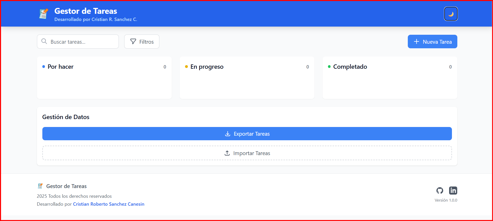

# Gestor de Tareas

Aplicación web para gestionar tareas, con soporte para prioridades, etiquetas, subtareas y estadísticas. Permite organizar tu flujo de trabajo de manera visual y eficiente.

## 👨‍💻 Autor


**Cristian R. Sanchez**  

*Desarrollador Web Full Stack*


📍 **Ubicación:** Buenos Aires, Argentina  

📧 **Email:** cris1411@gmail.com  

🔗 **LinkedIn:** [Cristian R. Sanchez](https://www.linkedin.com/in/cristian-roberto-sanchez-canesin-044283b7/)  

🐙 **GitHub:** [Cris1411](https://github.com/Cris1411)  

🌐 **Portfolio:** [mi Portfolio](https://cristian-mi-portfolio.netlify.app/)  


---

## 📅 Información del Proyecto


- **Fecha de Creación:** Marzo 2025

- **Última Actualización:** Mayo 2025

- **Versión:** 1.0.0

- **Estado:** ✅ Completado


---


## Captura de pantalla

A continuación puedes ver una vista de la interfaz principal de la aplicación:



*La imagen muestra la vista principal del gestor de tareas, donde puedes crear, organizar y gestionar tus tareas de manera visual, incluyendo prioridades, etiquetas y subtareas.*

---

## Tecnologías usadas

- [React](https://reactjs.org/)
- [Vite](https://vitejs.dev/)
- [Redux Toolkit](https://redux-toolkit.js.org/)
- [Tailwind CSS](https://tailwindcss.com/)
- [date-fns](https://date-fns.org/)
- [react-beautiful-dnd](https://github.com/atlassian/react-beautiful-dnd)

---

## Instalación

1. Clona el repositorio:
   ```sh
   git clone https://github.com/tuusuario/gestor-tareas.git
   cd gestor-tareas
   ```
2. Instala las dependencias:
   ```sh
   npm install
   ```

---

## Uso

- Para iniciar el servidor de desarrollo:
  ```sh
  npm run dev
  ```
- Para construir el proyecto para producción:
  ```sh
  npm run build
  ```
- Para previsualizar la build:
  ```sh
  npm run preview
  ```

---

## Contribución

¡Las contribuciones son bienvenidas!
Puedes abrir un issue para reportar bugs o sugerir mejoras.
Para contribuir con código:

1. Haz un fork del repositorio.
2. Crea una rama para tu feature/fix: `git checkout -b mi-feature`
3. Haz tus cambios y commitea: `git commit -am 'Añade nueva feature'`
4. Haz push a tu rama: `git push origin mi-feature`
5. Abre un Pull Request.

---

## Tests

Actualmente no hay tests automatizados.
(Si los agregas, describe aquí cómo correrlos).

---

## Licencia

MIT

- Crear una carpeta /src/pages para componentes de página completa
- Crear una carpeta /src/constants para valores constantes

3- Organización de componentes:
- Considera agrupar componentes relacionados en subcarpetas dentro de /components
- Por ejemplo: /components/forms, /components/ui, /components/tasks

4- Convenciones de nombrado:
- Usar PascalCase para componentes React (como ya lo haces con TaskColumn.jsx)
- Usar camelCase para archivos de utilidades
- Añadir sufijos descriptivos: .component.jsx, .service.js, .hook.js

5- Organización de pruebas y Testing:
- Crear una carpeta /__tests__ en cada directorio principal
- O una carpeta /src/tests para todas las pruebas

6- Definición de Tipos (si usas TypeScript):
- Crear una carpeta /src/types o /src/interfaces para definiciones de tipos

Esta estructura te ayudará a:

- Mantener el código organizado y fácil de encontrar
- Separar responsabilidades claramente
- Facilitar el mantenimiento y escalabilidad
- Mejorar la colaboración en el proyecto
- Aumentar la legibilidad y claridad del código

---


## 👨‍💻 Acerca del Autor


**Cristian R. Sanchez** es un desarrollador web apasionado por crear aplicaciones útiles y bien diseñadas. Este proyecto de lista de tareas fue desarrollado como parte de su portafolio personal, demostrando habilidades en:


- **Frontend:** HTML5, CSS3, JavaScript

- **Diseño:** Interfaces responsivas y accesibles

- **UX/UI:** Experiencias de usuario intuitivas

- **Almacenamiento:** Gestión de datos locales


### 🎯 Motivación del Proyecto

Esta aplicación nació de la necesidad de tener una herramienta simple pero efectiva para gestionar tareas diarias. El objetivo era crear una solución que fuera:

- Fácil de usar

- Visualmente atractiva

- Funcional sin dependencias externas

- Responsiva en todos los dispositivos


### 📞 Contacto

¿Tienes alguna pregunta o sugerencia sobre este proyecto? ¡No dudes en contactarme!


- **Email:** cris1411@gmail.com

- **LinkedIn:** [Cristian R. Sanchez](https://www.linkedin.com/in/cristian-roberto-sanchez-canesin-044283b7/)

- **GitHub:** [Cris1411](https://github.com/Cris1411)


---

*¡Gracias por revisar mi proyecto!* 🚀